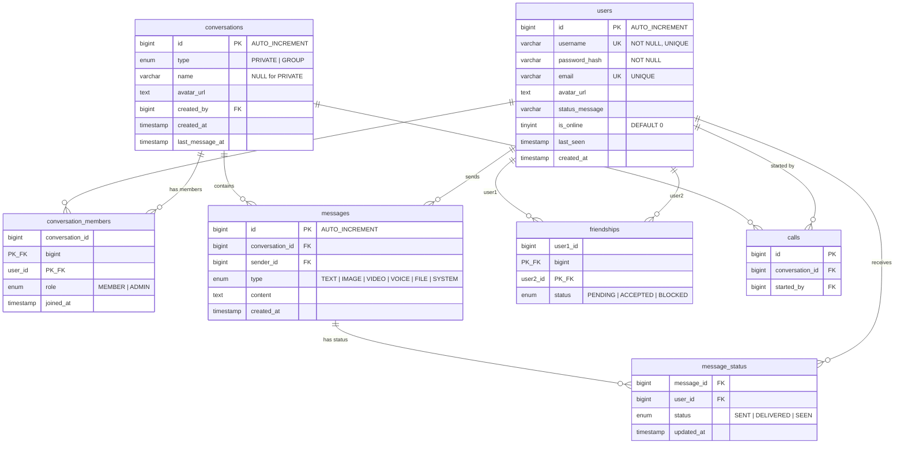

# 🖥️ SinChat Server Documentation

## Table of Contents

- [Overview](#overview)
- [Technology Stack](#technology-stack)
- [Architecture](#architecture)
- [Project Structure](#project-structure)
- [Configuration](#configuration)
- [API Reference](#api-reference)
- [WebSocket Protocol](#websocket-protocol)
- [Database Schema](#database-schema)
- [Security](#security)
- [Deployment](#deployment)
- [Testing](#testing)
- [Running Locally](#running-locally)

---

## Overview

The SinChat Server is a **Java-based backend** that powers the SinChat messaging application. It exposes a **RESTful HTTP API** for authentication, user management, and message operations, alongside a **WebSocket server** for real-time bidirectional communication (live messaging, typing indicators).

The server is designed to run as a **single deployable JAR**, containerised via Docker, and hosted on [Render](https://render.com/).

---

## Technology Stack

| Layer | Technology | Version | Purpose |
|---|---|---|---|
| **Language** | Java | 21 (LTS) | Core runtime |
| **HTTP Server** | `com.sun.net.httpserver.HttpServer` | JDK built-in | REST API endpoints |
| **WebSocket** | [Java-WebSocket](https://github.com/TooTallNate/Java-WebSocket) | 1.5.7 | Real-time messaging |
| **Database** | MySQL | 8.x | Persistent data storage |
| **DB Driver** | mysql-connector-j | 8.3.0 | JDBC connectivity |
| **Connection Pool** | [HikariCP](https://github.com/brettwooldridge/HikariCP) | 5.1.0 | High-performance connection pooling |
| **Password Hashing** | [jBCrypt](https://www.mindrot.org/projects/jBCrypt/) | 0.4 | BCrypt password hashing |
| **JSON** | [Gson](https://github.com/google/gson) | 2.10.1 | JSON serialisation/deserialisation |
| **Logging** | [SLF4J](https://www.slf4j.org/) + slf4j-simple | 2.0.13 | Structured logging |
| **Env Config** | [dotenv-java](https://github.com/cdimascio/dotenv-java) | 3.0.0 | `.env` file loading |
| **Build Tool** | [Apache Maven](https://maven.apache.org/) | 3.x | Dependency management & build |
| **Packaging** | maven-shade-plugin | 3.5.0 | Fat JAR with all dependencies |
| **Container** | [Docker](https://www.docker.com/) | Multi-stage | Production deployment |
| **Testing** | JUnit 5 + Mockito | 5.10.2 / 5.17.0 | Unit & integration tests |

---

## Architecture

The server follows a **layered architecture** pattern:

```
┌──────────────────────────────────────────────────────────────┐
│                      Client (JavaFX)                         │
├──────────────┬───────────────────────────────────────────────┤
│  HTTP (REST) │            WebSocket (ws://)                  │
├──────────────┴───────────────────────────────────────────────┤
│                   Handler Layer                              │
│  LoginHandler · RegisterHandler · ForgotPasswordHandler      │
│  ProfileHandler · AvatarHandler · SendMessageHandler         │
│  GetMessagesHandler · GetConversationsHandler                │
│  ConversationHandle · ChatWebSocket                          │
├──────────────────────────────────────────────────────────────┤
│                   Service Layer                              │
│  AuthService · MessageService · ConversationService          │
│  UserService · AvatarService                                 │
├──────────────────────────────────────────────────────────────┤
│                   Repository Layer                           │
│  UserRepository · MessageRepository                          │
│  ConversationRepository                                      │
├──────────────────────────────────────────────────────────────┤
│                   Data Layer                                  │
│  Database (HikariCP Connection Pool) → MySQL                 │
└──────────────────────────────────────────────────────────────┘
```

### Layer Responsibilities

| Layer | Responsibility |
|---|---|
| **Handler** | HTTP request/response handling, input validation, CORS headers, routing to services |
| **Service** | Business logic, password hashing, code generation, orchestration |
| **Repository** | Direct JDBC database queries, SQL execution, result mapping |
| **Model** | Plain Java objects (POJOs) representing database entities |
| **Config** | Database connection pool initialisation, environment variable loading |
| **WebSocket** | Real-time connection management, message broadcasting, typing indicators |

---

## Project Structure

```
Code/Server/
├── Dockerfile                          # Multi-stage Docker build
├── .dockerignore
├── pom.xml                             # Maven configuration & dependencies
└── src/
    ├── main/java/com/server/
    │   ├── Main.java                   # Application entry point (HTTP + WS servers)
    │   ├── ProfileHandler.java         # User profile GET/POST handler
    │   ├── config/
    │   │   └── Database.java           # HikariCP connection pool setup
    │   ├── handler/
    │   │   ├── auth/
    │   │   │   ├── LoginHandler.java        # POST /api/login
    │   │   │   ├── RegisterHandler.java     # POST /api/register
    │   │   │   └── ForgotPasswordHandler.java # GET|POST /api/forgotpwd
    │   │   ├── message/
    │   │   │   ├── SendMessageHandler.java       # POST /api/messages/send
    │   │   │   ├── GetMessagesHandler.java        # GET  /api/messages
    │   │   │   ├── GetConversationsHandler.java   # GET  /api/user/conversations
    │   │   │   └── ConversationHandle.java        # POST /api/conversations/get-or-create
    │   │   └── changeavatar/
    │   │       ├── AvatarHandler.java        # POST /api/change-avatar (multipart)
    │   │       └── MultipartParser.java      # Multipart form-data parser
    │   ├── model/
    │   │   ├── User.java               # User entity
    │   │   ├── Message.java            # Message entity (TEXT, IMAGE, VIDEO, etc.)
    │   │   ├── Conversation.java       # Conversation entity (PRIVATE, GROUP)
    │   │   ├── MessageStatus.java      # Message delivery status (SENT, DELIVERED, SEEN)
    │   │   ├── Friendship.java         # Friendship relation entity
    │   │   ├── Attachment.java         # File attachment entity
    │   │   └── ChangeAvatar.java       # Avatar change DTO
    │   ├── repository/
    │   │   ├── UserRepository.java     # User CRUD + password update
    │   │   ├── MessageRepository.java  # Message save + query by conversation
    │   │   └── ConversationRepository.java  # Conversation CRUD + membership
    │   ├── service/
    │   │   ├── AuthService.java        # Login, register, password reset logic
    │   │   ├── MessageService.java     # Message sending & retrieval
    │   │   ├── ConversationService.java # Get-or-create conversations
    │   │   ├── UserService.java        # User profile operations
    │   │   └── AvatarService.java      # Avatar update in DB
    │   └── websocket/
    │       └── ChatWebSocket.java      # WebSocket server (join, messaging, typing)
    └── test/java/com/server/
        ├── handler/                    # Handler unit tests
        ├── integration/                # API integration tests
        ├── model/                      # Model unit tests
        └── service/                    # Service unit tests
```

---

## Configuration

### Environment Variables

The server reads configuration from **environment variables** (or a `.env` file in `./Code/Server/`):

| Variable | Required | Default | Description |
|---|---|---|---|
| `PORT` | No | `3000` | HTTP server listening port |
| `DB_URL` | **Yes** | — | JDBC connection URL (e.g. `jdbc:mysql://host:3306/dbname`) |
| `DB_USER` | **Yes** | — | MySQL username |
| `DB_PASSWORD` | **Yes** | — | MySQL password |

### HikariCP Pool Settings

| Setting | Value | Note |
|---|---|---|
| Max Pool Size | 5 | Tuned for Render Free tier (0.1 CPU, 512 MB RAM) |
| Min Idle | 1 | Minimum idle connections |
| Connection Timeout | 10 s | Max wait for a connection from pool |
| Idle Timeout | 5 min | Remove idle connections |
| Max Lifetime | 10 min | Recycle connections |
| Keep-alive | 60 s | Ping idle connections to prevent stale connections |

### Example `.env` file

```env
PORT=3000
DB_URL=jdbc:mysql://your-host:3306/your_database
DB_USER=your_username
DB_PASSWORD=your_password
```

---

## API Reference

**Base URL:** `http://localhost:3000` (local) · `https://network-programming-project.onrender.com` (production)

All endpoints return JSON with `Content-Type: application/json` and include CORS header `Access-Control-Allow-Origin: *`.

---

### Authentication Endpoints

#### `POST /api/register`

Create a new user account.

**Request Body:**
```json
{
  "username": "john_doe",
  "password": "MyP@ssw0rd",
  "email": "john@example.com"
}
```

**Success Response (200):**
```json
{
  "status": "success",
  "message": "Registration successful"
}
```

**Error Responses:**

| Status | Condition |
|---|---|
| `400` | Missing fields, duplicate username/email, or registration failed |
| `405` | Non-POST method |
| `500` | Internal server error |

---

#### `POST /api/login`

Authenticate an existing user.

**Request Body:**
```json
{
  "username": "john_doe",
  "password": "MyP@ssw0rd"
}
```

**Success Response (200):**
```json
{
  "status": "success",
  "userId": 1,
  "username": "john_doe"
}
```

**Error Responses:**

| Status | Condition |
|---|---|
| `400` | Missing username or password |
| `401` | Invalid credentials |
| `405` | Non-POST method |
| `500` | Internal server error |

---

#### `GET /api/forgotpwd` — Request Reset Code

Generate a 6-digit password reset code.

**Request Body (JSON in GET body):**
```json
{
  "username": "john_doe"
}
```

**Success Response (200):**
```json
{
  "status": "success",
  "message": "Mã xác nhận đã được tạo.",
  "code": "482719"
}
```

> ⚠️ **Note:** The reset code is returned directly in the response for development/testing. In production, this should be sent via email.

---

#### `POST /api/forgotpwd` — Request Code or Reset Password

This endpoint handles two cases based on the request body:

**Case 1 — Request code** (body has `username`, no `code`):
```json
{ "username": "john_doe" }
```
→ Returns a 6-digit code (same as GET).

**Case 2 — Reset password** (body has `code` and `password`):
```json
{
  "code": "482719",
  "password": "NewP@ssw0rd"
}
```

**Success Response (200):**
```json
{
  "status": "success",
  "message": "Đổi mật khẩu thành công"
}
```

| Status | Condition |
|---|---|
| `400` | Invalid/expired code or missing fields |
| `404` | User not found |
| `500` | Internal server error |

---

### Profile Endpoints

#### `GET /api/profile?userId=1`

Retrieve a user's profile information.

#### `POST /api/profile`

Update a user's profile (username, status message, etc.).

---

### Messaging Endpoints

#### `POST /api/messages/send`

Send a text message to a conversation. Also broadcasts the message to all conversation members via WebSocket.

**Request Body:**
```json
{
  "conversationId": 1,
  "senderId": 1,
  "content": "Hello, world!"
}
```

**Success Response (200):**
```json
{
  "status": "success",
  "messageId": 42
}
```

| Status | Condition |
|---|---|
| `400` | Missing fields or empty content |
| `405` | Non-POST method |
| `500` | Internal server error |

---

#### `GET /api/messages?conversationId=1`

Retrieve all messages in a conversation.

**Success Response (200):**
```json
{
  "status": "success",
  "conversationId": 1,
  "count": 3,
  "messages": [
    {
      "id": 1,
      "conversationId": 1,
      "senderId": 1,
      "type": "TEXT",
      "content": "Hello!",
      "createdAt": "2026-05-13T16:07:14.000+00:00"
    }
  ]
}
```

---

### Conversation Endpoints

#### `POST /api/conversations/get-or-create`

Get an existing private conversation between two users, or create one if it doesn't exist.

**Request Body:**
```json
{
  "user1Id": 1,
  "user2Id": 2
}
```

**Success Response (200):**
```json
{
  "status": "success",
  "conversationId": 5
}
```

---

#### `GET /api/user/conversations?userId=1`

Get all conversations a user belongs to, with details (last message, participants, etc.).

**Success Response (200):**
```json
{
  "status": "success",
  "data": [
    {
      "conversationId": 1,
      "type": "PRIVATE",
      "name": null,
      "lastMessage": "Hello!",
      "lastMessageAt": "2026-05-13T16:10:00"
    }
  ]
}
```

---

### Avatar Endpoint

#### `POST /api/change-avatar`

Upload a new avatar image. Accepts `multipart/form-data`.

**Form Fields:**

| Field | Type | Description |
|---|---|---|
| `userId` | text | ID of the user |
| `avatar` | file | Image file (jpg, jpeg, png, gif, webp). Max 5 MB |

**Success Response (200):**
```json
{
  "status": "success",
  "message": "Cập nhật avatar thành công",
  "avatarUrl": "/uploads/avatars/abc123.jpg"
}
```

---

### Static File Serving

#### `GET /uploads/*`

Serves uploaded files (avatars, etc.) from the `uploads/` directory. Includes **path traversal protection** — requests are normalised and verified to be within the uploads directory.

---

### Health Check

#### `GET /api/test`

Simple health-check endpoint.

**Response (200):**
```
server worked!
```

---

## WebSocket Protocol

**WebSocket URL:** `ws://localhost:8887` (default port)

The WebSocket server handles real-time communication using JSON messages. Every message has an `action` field to identify its type.

### Connection Flow

```
Client                          Server
  │                                │
  ├──── WebSocket Connect ────────►│
  │                                │ onOpen()
  ├──── { "action": "join",  ─────►│
  │       "userId": 1 }           │
  │                                │ Register user ↔ connection mapping
  │◄──── { "action": "joined", ───┤
  │        "userId": 1 }          │
  │                                │
  │       ═══ Connected ═══        │
```

### Client → Server Actions

#### `join` — Register User Session

```json
{
  "action": "join",
  "userId": 1
}
```

Maps the WebSocket connection to a user ID. A single user may have **multiple connections** (e.g. multiple tabs). The server responds with `{"action": "joined", "userId": 1}`.

#### `send_message` — Send Message via WebSocket

```json
{
  "action": "send_message",
  "conversationId": 1,
  "senderId": 1,
  "content": "Hello!"
}
```

The server:
1. Persists the message to the database via `MessageService`
2. Broadcasts a `new_message` event to **all members** of the conversation

#### `typing` — Typing Indicator

```json
{
  "action": "typing",
  "conversationId": 1,
  "userId": 1
}
```

Broadcasts a `user_typing` event to all **other** members of the conversation (excludes the sender).

### Server → Client Events

| Action | Payload Fields | Description |
|---|---|---|
| `joined` | `userId` | Acknowledgement of successful join |
| `new_message` | `messageId`, `conversationId`, `senderId`, `content`, `createdAt` | A new message was sent in a conversation |
| `user_typing` | `conversationId`, `userId` | A user is typing in a conversation |
| `error` | `message` | An error occurred processing the client's request |

### Connection Management

- User connections are stored in a **`ConcurrentHashMap<Long, Set<WebSocket>>`** (one user → many connections)
- A reverse map **`ConcurrentHashMap<WebSocket, Long>`** tracks which user owns each connection
- On disconnect, connections are cleaned up from both maps
- **Connection lost timeout:** 60 seconds

---

## Database Schema

The server uses a **MySQL** database (`utf8mb4_unicode_ci`). Below is the entity-relationship diagram:



### Tables Summary

| Table | Description |
|---|---|
| `users` | User accounts with credentials, profile, and online status |
| `conversations` | Chat conversations (private 1-on-1 or group) |
| `conversation_members` | Many-to-many join table for conversation membership with roles |
| `messages` | All chat messages with type enum (TEXT, IMAGE, VIDEO, VOICE, FILE, SYSTEM) |
| `message_status` | Per-user delivery tracking (SENT → DELIVERED → SEEN) |
| `friendships` | Friend relationships with status (PENDING, ACCEPTED, BLOCKED) |
| `calls` | Voice/video call records (schema prepared, not yet implemented) |

---

## Security

| Feature | Implementation |
|---|---|
| **Password Hashing** | BCrypt via `jBCrypt` library (`BCrypt.hashpw` / `BCrypt.checkpw`) |
| **CORS** | `Access-Control-Allow-Origin: *` on all endpoints with OPTIONS preflight support |
| **Path Traversal Protection** | Upload file paths are normalised and verified against the upload base directory |
| **Input Validation** | All handlers validate required fields and return `400` for missing/invalid input |
| **SQL Injection Prevention** | All database queries use **PreparedStatement** with parameterised queries |
| **File Upload Limits** | Max 5 MB file size for avatars; file extension whitelist (jpg, png, gif, webp) |

---

## Deployment

### Docker

The server uses a **multi-stage Docker build**:

1. **Build stage** — `eclipse-temurin:21-jdk-jammy` with Maven to compile and package
2. **Run stage** — `eclipse-temurin:21-jre-jammy` with only the fat JAR

```dockerfile
# Build
FROM eclipse-temurin:21-jdk-jammy AS build
RUN apt-get update && apt-get install -y maven
WORKDIR /app
COPY pom.xml .
COPY src ./src
RUN mvn clean package -DskipTests

# Run
FROM eclipse-temurin:21-jre-jammy
WORKDIR /app
COPY --from=build /app/target/render-java-server-1.0-SNAPSHOT.jar app.jar
EXPOSE 3000
ENTRYPOINT ["java", "-jar", "app.jar"]
```

### Render Deployment

The server is deployed on [Render](https://render.com/) as a **Docker web service**:

- Render sets the `PORT` environment variable automatically
- The HTTP server binds to that port
- Database credentials are set as Render environment variables
- Live URL: `https://network-programming-project.onrender.com`

### Docker Compose (Local Development)

A `docker-compose.yml` is provided for running the server + MySQL locally:

```yaml
services:
  app:
    build: .
    ports:
      - "8080:8080"
    depends_on:
      db:
        condition: service_healthy
  db:
    image: mysql:8
    environment:
      - MYSQL_ROOT_PASSWORD=root
      - MYSQL_DATABASE=mydb
    ports:
      - "3306:3306"
```

---

## Testing

The server has a comprehensive test suite using **JUnit 5** and **Mockito 5**:

```
src/test/java/com/server/
├── handler/         # Handler unit tests
├── integration/     # End-to-end API integration tests
├── model/           # Model/entity unit tests
└── service/         # Service layer unit tests
```

### Running Tests

```bash
# Run all tests
mvn test

# Run with ByteBuddy experimental mode (required for Mockito with Java 21)
mvn test -Dnet.bytebuddy.experimental=true
```

> The `maven-surefire-plugin` is pre-configured with `-Dnet.bytebuddy.experimental=true` in `pom.xml`.

---

## Running Locally

### Prerequisites

- **Java 21** (or later)
- **Maven 3.x**
- A running **MySQL** instance

### Steps

1. **Clone the repository:**
   ```bash
   git clone https://github.com/ThaiDevv/sinchat-network-programming.git
   cd sinchat-network-programming
   ```

2. **Configure environment:** Create `Code/Server/.env`:
   ```env
   PORT=3000
   DB_URL=jdbc:mysql://localhost:3306/sinchat
   DB_USER=root
   DB_PASSWORD=your_password
   ```

3. **Import the database schema:**
   ```bash
   mysql -u root -p sinchat < Code/Database/dump-roacqgfa_ltm-202605132325.sql
   ```

4. **Build and run:**
   ```bash
   cd Code/Server
   mvn clean package -DskipTests
   java -jar target/render-java-server-1.0-SNAPSHOT.jar
   ```

5. **Verify:** Open `http://localhost:3000/api/test` — you should see `server worked!`

The **HTTP server** starts on port `3000` (or `PORT` env var) and the **WebSocket server** starts on port `8887`.
